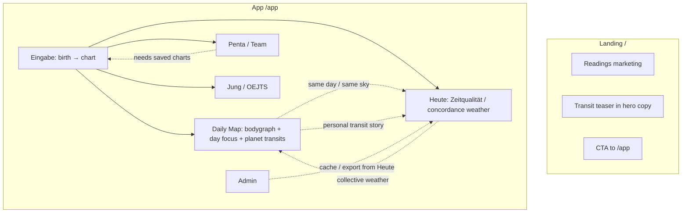
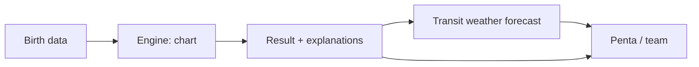

# Product Overview — What We Have, Where It Overlaps, Where We Go

**Goal (your brief):** One publishable product. Calculation engine must work. Then a clear results field with explanations. From there, look into **Penta** (team field — “Panthers” in speech). Above everything: **transits** as a Human Design “weather forecast.”

**Scope of this doc:** Inventory of the current repo (`trade-Strat-1`), overlap map, target IA, and what we still need. Notion/Figma were not reachable from this environment (auth only in desktop Cursor), so this is based on the live codebase and README.

---

## 1. What exists today (surfaces)

### A. Marketing / Readings landing — `/` (`index.html`)

Public Samadhi / Paradise Ventures page. Not the calculation product.

| Section | Topic |
|--------|--------|
| Hero | Brand + “design in normal language” + WhatsApp CTA + link to free map (`/app/`) |
| How it works (`#how`) | Promise + 4 journey steps |
| Lens (`#lens`) | Kreislauf vs Pendel framing |
| Offerings (`#offer`) | 3 reading packages + pay (bank/crypto) |
| About (`#about`) | Samadhi / PV + personal HD mechanics |
| Close / book | WhatsApp again |

`landing.html` only redirects to `/`.

### B. Daily Energy Map app — `/app/` (`app/index.html` + modules)

One large SPA with **6 tabs**:

| Tab | What it does | Core topics |
|-----|----------------|-------------|
| **Daily Map** | Main day view: scores, live bodygraph, day focus / explanations, PHS, open centers, profile strip | Chart + **planet gate transits** + personal reading |
| **Heute / Today** | “Zeitqualität”: ephemeris events (aspects, ingresses, stations, lunations) → HD+Astro concordance, type lens, day/week/month | Collective **time weather** + type guidance |
| **Penta / Team** | 2-person compare or 3–5 Penta field: channels, core centers, synthesis, peripheral influences | Team / group mechanics |
| **Jung / OEJTS** | 32-item Jung type test + interpretation + optional HD compare | Personality layer (not HD engine) |
| **Eingabe / Input** | Birth data → calculate & save chart; create/edit profiles | Onboarding / chart source of truth |
| **Admin** | Local DB: profiles, Penta toggles, transit cache, concordance export/reset | Ops / debug (not end-user) |

Shared chrome: profile picker, DE/EN, date bar (on several tabs), transit on/off (Daily Map).

### C. Calculation / content modules (engines)

| Module | Role | Status (code-level) |
|--------|------|---------------------|
| `hd-engine.js` + Swiss Ephemeris (`vendor/`) | Birth chart: gates, lines, centers, channels, type/authority/strategy inputs | Present; browser verify needs Playwright |
| `hd-logic.js` | Profile DB, chart pipeline, day model (chart vs chart+transits), bodygraph CSS | Present (engine version 7 in logic) |
| Inline in `app/index.html` | Transit cache, impact copy, scores, Daily Map UI, Penta UI, Heute UI | Huge monolith (~7k lines HTML/JS) |
| `zeitqualitaet-core.js` | Event detection → concordance (HD + Astro) | Present; powers **Heute** |
| `oejts-core.js` + `oejts-interpret.js` | Jung test + prose | Present; separate product layer |

Default profiles in app: e.g. Daniel, Patrick, Paradise (brand).

---

## 2. Topic map — where the same idea appears twice



### Overlap matrix (the confusion)

| Topic | Appears in | Overlap problem |
|-------|------------|-----------------|
| **Transits / “weather”** | Daily Map (planet→gate on bodygraph + Tages-Fokus), Heute (Zeitqualität events), Landing (marketing teaser) | Two different transit products side by side: **gate overlay** vs **ephemeris concordance**. User doesn’t know which is “the forecast.” |
| **Day reading / explanations** | Daily Map (Tages-Fokus, mantra, mindfulness, impact cards), Heute (type hero + Deutung stack) | Same job (“what does today mean?”) twice, different language and depth. |
| **Chart result** | Eingabe (preview after save), Daily Map (bodygraph + baseline), Jung (HD compare if chart exists) | Result is scattered; no single “your chart explained” destination. |
| **Profile / person** | Global bar on every tab, Eingabe, Admin, Penta picker | Profile UX repeated; Admin duplicates Penta member toggles. |
| **Date navigation** | Daily Map, Heute, Penta | Same control, three places; scopes differ (Heute has day/week/month). |
| **Scores / “best moment”** | Daily Map sidebar only | Promise of landing/README (“best moment for what”) lives only here — not unified with Heute weather. |
| **Team / Penta** | Penta tab only (plus Admin toggles) | Clearer than transit overlap, but still depends on charts from Eingabe with little guided flow. |
| **Jung** | Own tab + profile labels everywhere | Parallel system; fine as optional layer, but clutters publish path if shown as equal peer to HD. |

**Bottom line:** The engines are mostly there; the **information architecture** duplicates “today” and never forces a single path: Input → Result → Weather → Penta.

---

## 3. Target product (simplified publish path)

One linear story, matching what you described:

```text
1) CALCULATE     → birth data in, reliable chart out
2) RESULT        → one field: chart + plain-language explanations
3) WEATHER       → transits on top: HD “weather forecast” (day / week)
4) PENTA         → from result/weather, open team field (3–5) or 1:1
```

### Proposed surface map (collapse 6 tabs → ~4 user steps + hidden admin)

| Step | User sees | Reuses from today | Drop / demote |
|------|-----------|-------------------|---------------|
| **1. Chart** | Birth form → calculate | `Eingabe` + `hd-engine` / `hd-logic` | Don’t show Admin; don’t require picking built-in profiles first |
| **2. Result** | Bodygraph + type/authority/strategy + center/gate explanations | Daily Map bodygraph + chart-only focus + reading cards | Split “chart story” away from live transit noise initially, or clearly labeled layers |
| **3. Weather (top priority)** | One forecast: collective sky + how it hits *this* chart | Merge **Heute Zeitqualität** + Daily Map transit layer + scores into one “Wetter” view | Stop having Daily Map and Heute as sibling equals |
| **4. Penta** | “Look into the field” from result | Existing Penta analysis | Keep Admin toggles internal |

**Jung / OEJTS:** keep as optional secondary (“personality lens”), not in the primary publish path.

**Landing:** stay marketing; CTA should land on step 1 (calculate), not into a 6-tab lab.

### Ideal user flow



---

## 4. What we already have vs what we still need

### Already have (keep / wire)

- Swiss Ephemeris in browser + chart calculation pipeline  
- Planet gate transits + temporary channels + impact copy (Daily Map)  
- Zeitqualität concordance engine (Heute) — closest to “weather forecast”  
- Penta / pair analysis with Ra-style synthesis  
- Profile persistence (localStorage)  
- DE/EN strings throughout  
- Landing for readings business  

### Need for a publishable product (us / next build)

| Need | Why | Notes |
|------|-----|--------|
| **Single IA / navigation** | Kill Daily Map vs Heute twin | One “Wetter” that owns forecast; Result owns chart story; Penta is drill-down |
| **Hardened calculation path** | “Engine must work” | Automated chart regression (Playwright or Node), clear errors, no stale charts without prompt |
| **Result screen with explanations** | You asked for a dedicated field | Curate one narrative stack (type → authority → open centers → key channels); not three panels saying similar things |
| **Transit weather as the top layer** | Your priority | Productize Heute + personal hit: headline forecast, then “how it touches you,” then optional tech detail |
| **Guided Penta entry** | “From there look into Penta” | CTA from Result/Weather; require 3–5 saved charts; hide Admin duplication |
| **Publish hygiene** | Confusing for strangers | Hide Admin; simplify profile defaults; guest “new person” first; optional Jung behind “more” |
| **Host / brand** | README: paradise.ventures still old host | Point domain at this Pages deploy when ready |
| **Content QA** | Duplicate prose risk | One copy source for gate/center/transit explanations |

### Explicit non-goals for first publish

- Full Jung as equal main tab  
- Admin / concordance training export in the public UI  
- Perfect week/month UI before day weather is clear  

---

## 5. Suggested consolidation plan (implementation order)

1. **Freeze engines** — chart + transit + Zeitqualität as shared services; stop adding parallel copy in new places.  
2. **Define three public routes/views** — `Chart` → `Result` → `Weather` (+ `Penta` linked). Map old tabs into these.  
3. **Merge transit UIs** — Weather = Zeitqualität headline + personal gate overlay / scores underneath (or tabs *inside* Weather, not app-level).  
4. **Result explanations** — one scroll: summary, bodygraph, expandable centers/gates.  
5. **Penta entry** — button from Result/Weather; reuse current analyzer.  
6. **Ship** — hide Admin, guest onboarding, landing CTA → Chart, smoke-test engine on real births.  

---

## 6. Quick reference — files

| Path | Owns |
|------|------|
| `index.html` | Marketing landing |
| `app/index.html` | Almost all UI (tabs, copy, Penta, Heute, Daily Map) |
| `app/hd-engine.js` | Chart math |
| `app/hd-logic.js` | Profiles + day model |
| `app/zeitqualitaet-core.js` | Weather/concordance events |
| `app/oejts-*.js` | Jung layer |
| `README.md` | Deploy / how to run |

---

## 7. Decision checklist (for you)

- Confirm **“Panthers” = Penta / Team** (assumed yes).  
- Confirm Weather = **merge Heute + Daily Map transits**, not keep both.  
- Confirm Jung is **optional**, not in v1 publish path.  
- Confirm first public user is **guest birth form**, not preloaded Daniel/Patrick/Paradise.

Once those are locked, implementation is mostly **re-routing and merging existing engines**, not inventing a new calculation stack from scratch.
